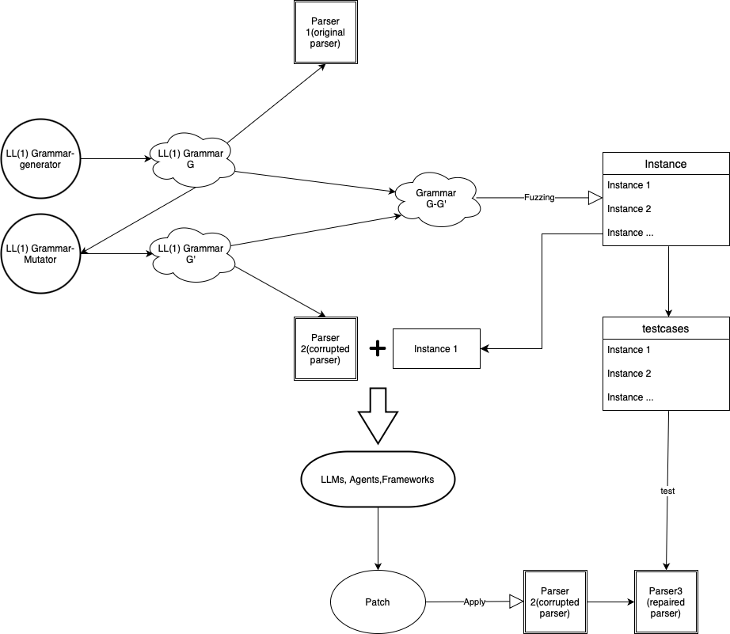
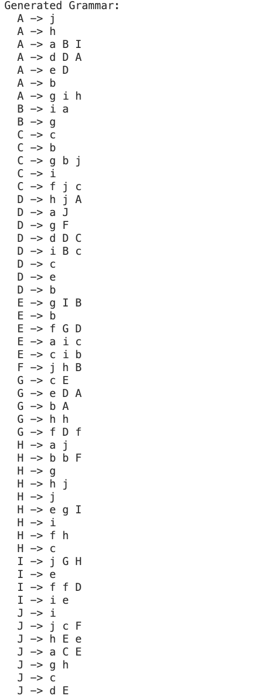
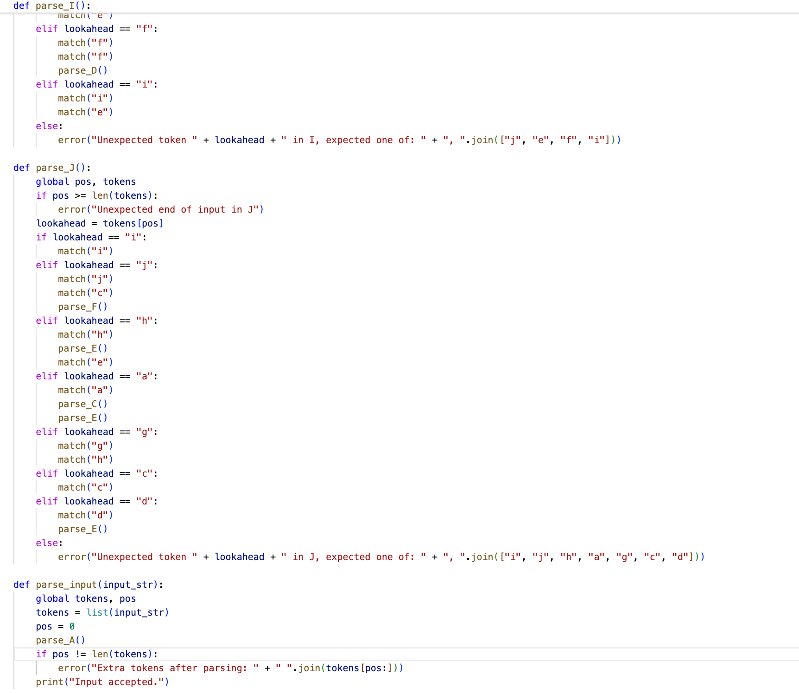
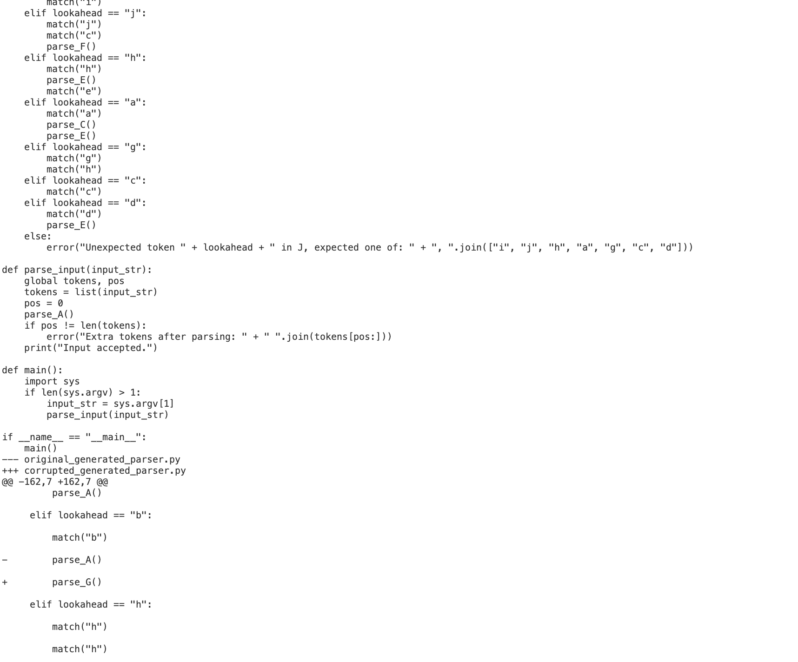
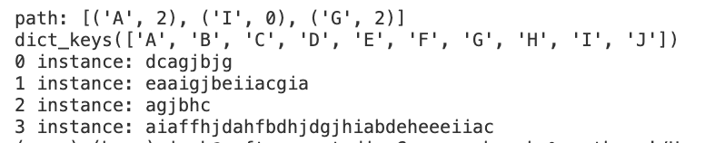

# Grammar_bench

## Artifact repository

This repository is the artifact repository of Grammar_bench.

***Grammar-bench is our newly proposed benchmarking framework designed to evaluate the capability of large language models or intelligent agents on software engineering tasks. Compared to existing benchmarks in the SWE-bench series, grammar-bench is fully anonymized and randomized. We use interpreters for randomly generated grammars as target programs, creating a new program in every run. This approach prevents LLM developers from intentionally overfitting their models using pretrained test datasets to achieve higher scores, thereby ensuring our goal of unbiased evaluation.***

### Pipline

### Gammar generation and parser generation

### Mutate original parser

### Cross-validation test cases generation
