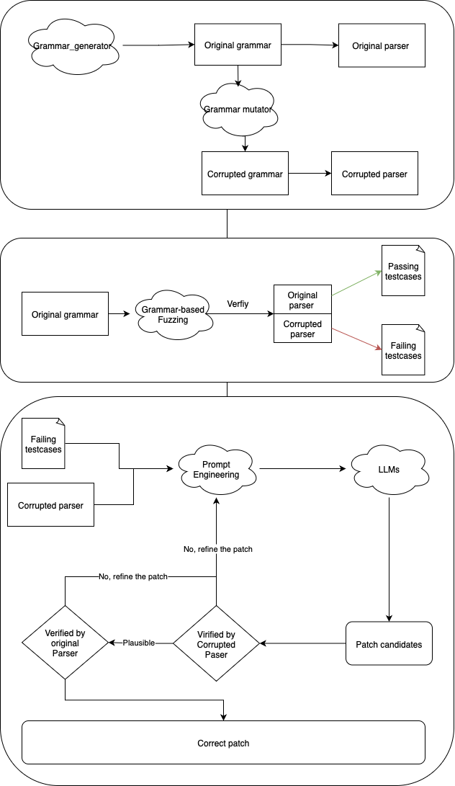

# Grammar_bench

A randomized, anonymized benchmarking framework for software engineering tasks. Grammar-bench builds a large number of verifiable tasks by “randomly generating grammars → generating parsers → injecting minimal faults → auto-generating test cases.” It aims to fairly evaluate Large Language Models (LLMs) or autonomous agents on program repair and patch generation without overfitting to public datasets.

- Randomized: Every run produces a brand-new target program (a parser) and grammar.
- Anonymized: Targets are interpreters for random grammars, decoupled from real-world project context to reduce train–test leakage.
- Verifiable: Automatically generates both “should pass” and “should fail” inputs, with fast in-process validation.
- Scalable: Stores artifacts in SQLite, supports parallel generation and reuse; the repair pipeline supports multiple LLM backends.

## Pipeline


## Repository structure

- `main.py`: Core data generator. Produces a valid (original) grammar and parser, applies a minimal mutation, searches failing inputs, and stores all artifacts into SQLite.
- `grammar_gen.py`: Random LL(1)-style grammar generation and iterative (non-recursive) parser code generation (computes FIRST sets and nullability; emits iterative parse code).
- `mutation.py`: Applies a single, targeted mutation to the grammar (replace a terminal in a production of the last nonterminal) to minimally break behavior.
- `testies.py`: Biased example generator that follows the derivation path from the root to the mutated nonterminal to more easily trigger the bug.
- `ultility.py`: Utilities for in-/out-of-process validation, edit distance, grammar traversal and path computation, shortcut strings, complexity helpers, etc.
- `benchmark.py`: Program repair benchmark. Given corrupted parsers from SQLite plus failing/passing cases, calls an LLM to produce and refine unified diff patches, applies them, compiles, runs regression tests, and records results.
- `localisation.py`: Prompt templates and patch refiners (format/line, grammar, logic), wrapping `ai_interface.py` and `models.py`.
- `ai_interface.py` / `models.py`: A unified interface and lightweight accounting for multiple backends (OpenAI / Ollama / Gemini / Claude / Together).
- `repair_results_analysis.ipynb`: Jupyter notebook for analyzing repair outcomes.
- `pics/`: Figures (pipeline, original/corrupted grammar and parser, test cases, etc.).
- Others: `.gitignore`, `.gitattributes`, `.gitmodules`, `grammar.json`, `json2bnf.py`, `patch.py`, etc.

## Installation

- Python 3.10+ (recommended)
- System tool: `patch` (usually available on macOS/Linux)
  - Ubuntu/Debian: `sudo apt-get install patch`
  - macOS: built-in `patch` is typically sufficient (Homebrew `gpatch` optional)
- Python packages:
  - Benchmarking/generation: `radon` (for cyclomatic complexity), stdlib `sqlite3`, `concurrent.futures`, etc.
  - LLM backends (install what you need): `openai`, `ollama`, `google-genai`, `anthropic`, `together`

Example:
```bash
python3 -m venv .venv && source .venv/bin/activate
pip install radon openai ollama google-genai anthropic together
```

Backend environment variables (set according to your choice):
- OpenAI: `export OPENAI_API_KEY=...`
- Gemini: `export GOOGLE_GENAI_API_KEY=...`
- Claude: `export ANTHROPIC_API_KEY=...`
- Together: `export TOGETHER_API_KEY=...`
- Ollama: run `ollama serve` locally and pull a model, e.g. `ollama pull qwen2.5-coder:7b`

## Quick start

### 1) Generate dataset (grammar/parser + failing/passing inputs → SQLite)

Parallel generation with default sweep (see parameters below). The default DB filename is defined in `Config.DB_FILE` (currently `targets17.db`):
```bash
python3 main.py -w 4 -c 10
```

Custom single setting (must provide `--num-nonterminals`, `--nonterminal-prob`, and `--loop-prob`. If `--max-productions`/`--max-rhs-length` are omitted, they default to `num_nonterminals`):
```bash
python3 main.py \
  --num-nonterminals 6 \
  --nonterminal-prob 0.5 \
  --loop-prob 0.5 \
  -c 20 -w 4
```

Sweep (manual list):
```bash
python3 main.py --dim 3,6,9 -c 5 -w 6
```

Sweep (auto mode: specify `--dim` without a value; then `max_productions` and `max_rhs_length` equal the current dimension):
```bash
python3 main.py --dim -c 2 -w 4
```

Use an external grammar (JSON) for mutation and failing-case discovery (skips random generation):
```bash
python3 main.py --grammar-file grammar.json -c 5
```

After generation, the `cases` table includes (columns evolve with auto-migrations):
- `id` (PK, autoincrement)
- `num_nonterminals` (number of nonterminals)
- `nonterminal_prob`, `loop_prob` (probability params for generation)
- `mutation_depth` (distance from root to mutated nonterminal; root depth = 1)
- `original_grammar` (JSON)
- `original_parser` (source)
- `corrupted_grammar` (JSON)
- `corrupted_parser` (source)
- `corrupted_symbol_count` (unique symbols in corrupted grammar = nonterminals + terminals)
- `parser_size` (length of corrupted parser source)
- `failing_test_cases` (JSON array; cases wrapped into full-input context)
- `passing_test_cases` (JSON array)
- `cc_complexity`, `cc_rank` (cyclomatic complexity and rank via `radon`)

Note: `benchmark.py` defaults to reading `parser_cases.db`, while `main.py` currently writes to `targets17.db`. When running the repair benchmark, pass `--db-path targets17.db`.

### 2) Run the program repair benchmark

OpenAI example:
```bash
export OPENAI_API_KEY=sk-...
python3 benchmark.py \
  --backend openai \
  --model o1-mini-2024-09-12 \
  --db-path targets17.db \
  --workers 4
```

Ollama example (local inference):
```bash
ollama serve &  # if not already running
ollama pull qwen2.5-coder:7b
python3 benchmark.py \
  --backend ollama \
  --model qwen2.5-coder:7b \
  --db-path targets17.db \
  --workers 4
```

The results database will be named automatically if not provided (e.g., `repair_results_openai_o1-mini-2024-09-12_targets17.db`). Table `repair_results` includes:
- `case_id`, `sample` (composite PK; currently one run per case with `sample=1`)
- `num_nonterminals`, `nonterminal_prob`, `loop_prob`
- `total_failing`, `passed_failing`
- `total_passing`, `passed_passing`
- `plausible` (all failing cases pass)
- `correct` (plausible and all passing cases still pass)
- `prompt_tokens`, `completion_tokens`, `total_tokens` (model usage)

Repair loop outline:
1. Read the corrupted parser and deduplicated failing cases.
2. Ask the model for a unified diff patch (`localisation.py` prompts).
3. Apply with system `patch`; on failure, refine (format/lines, grammar, logic) up to 10 rounds.
4. Compile check: `python3 -m py_compile`.
5. Regression test on failing and passing sets; compute `plausible`/`correct`.
6. Record usage and outcomes; clean temporary files.

### 3) Analyze results

Open `repair_results_analysis.ipynb` and point it to a `repair_results_*.db` to visualize and aggregate metrics.

## Design and algorithm highlights

- Random grammar (`generate_random_grammar`)
  - Forward references only; each nonterminal expanded at least once.
  - FIRST disambiguation (distinct leading terminals for LL(1)-style decisions).
  - Optional simple right recursion (`X -> α X | ε`).
  - If generation fails to meet the target number of nonterminals, the caller retries.

- Parser code generation (`generate_parser_code`)
  - Undecorates `<A>`-style symbols, computes FIRST and nullability.
  - Emits iterative, non-recursive parser code for iterative/nullable structures.
  - Entry `parse(inp)` tokenizes the input into a char list; success prints “Input accepted.”, otherwise raises `ParseError`.

- Grammar mutation (`mutate_grammar`)
  - Minimal change: replace a terminal within a production of the last nonterminal to create a bug with small edit distance.

- Failing and passing test cases
  - Failing: follow the derivation path to the mutated nonterminal (biased generation), then select inputs accepted by the original but rejected by the corrupted parser.
  - Passing: random generation that both original and corrupted parsers accept.

- Metrics and extras
  - `radon` to compute cyclomatic complexity and rank of the corrupted parser.
  - Store `mutation_depth`, `corrupted_symbol_count`, parser size, etc. for downstream analysis.

## CLI reference

`main.py` (generation):
- `-w, --workers`: number of worker processes (default: `cases_per_setting`)
- `-c, --cases-per-setting`: samples per setting (default `10`)
- `--grammar-file`: mutate a provided `grammar.json` (skip random generation)
- Custom grammar parameters:
  - `--num-nonterminals`
  - `--max-productions` (max productions per nonterminal)
  - `--max-rhs-length` (max RHS length)
  - `--nonterminal-prob` (probability to introduce a new nonterminal)
  - `--loop-prob` (right-recursive probability; should satisfy `nonterminal_prob + loop_prob < 1`)
- Sweep:
  - `--dim 3,6,9`: explicit list
  - `--dim` (no value): auto mode (`max_productions/max_rhs_length` = current dim)
- Search/generation bounds:
  - `--max-examples`, `--max-mutate-attempts`, `--max-instance-search`

`benchmark.py` (repair):
- `--backend`: `openai` / `ollama` / `gemini` / `claude` / `together`
- `--model`: model name (e.g., `o1-mini-2024-09-12`, `qwen2.5-coder:7b`)
- `--db-path`: input SQLite containing table `cases` (e.g., `targets17.db`)
- `--results-db`: output SQLite (optional; auto-named if omitted)
- `--workers`: parallel workers

## FAQ

- “`patch` not found / patch apply failed”: ensure the system `patch` tool is installed. When applying fails, the script automatically refines the patch (format/line numbers first, then grammar/logic) up to 10 times.
- “No valid failing cases / repeated resubmissions”: generation has timeouts and retries (see `Config.TIMEOUT`, `MAX_MUTATE_ATTEMPTS`). Under extreme parameters, consider increasing the limits.
- “DB filename mismatch”: `main.py` writes to `targets17.db` by default, while `benchmark.py` expects `parser_cases.db` unless you specify `--db-path targets17.db`.


## License

Unless otherwise stated, this repository is intended for academic research and benchmarking purposes. Please acknowledge the source when using or referencing the code and results.

---

